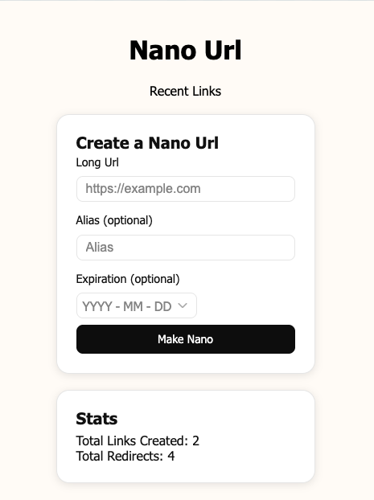
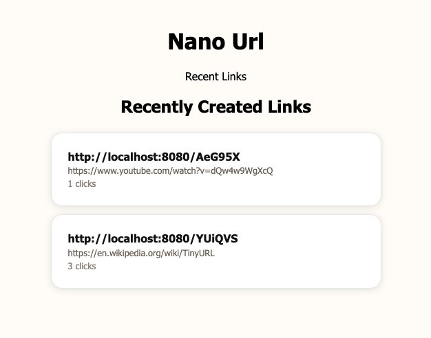

# nano-url

A tiny, fast URL shortener written in Rust — built as a single [Dioxus](https://dioxuslabs.com) fullstack app (Rust frontend + Axum server + SQLite).

Create short links with an optional custom alias and expiration, get one-click nano links, and watch live stats and a feed of recently created links.

## Screenshots

<p align="center">
  <strong>Create a link</strong><br>
  
</p>

<p align="center">
  <strong>Recently created links</strong><br>
  
</p>

## Features

- **Short links** — random, collision-checked 6-character base62 codes (`nano.url/YUiQVS`).
- **Custom aliases** — bring your own code; conflicts return a clean `409`.
- **Expiration** — optional expiry date; expired links return `404`.
- **Hit counting** — each redirect is counted atomically.
- **Live stats** — total links created and total redirects.
- **Recent feed** — the latest links with their original URL and click count.
- **Inline validation** — client-side field validation plus server-side defense in depth.

## Tech stack

- [Dioxus 0.7](https://dioxuslabs.com) (fullstack, router) — UI and server functions in one Rust codebase
- [Axum](https://github.com/tokio-rs/axum) — HTTP server and the redirect route
- [SQLx](https://github.com/launchbadge/sqlx) + SQLite — storage and migrations

## Getting started

### Prerequisites

- A recent Rust toolchain (edition 2024)
- The Dioxus CLI:

  ```bash
  cargo install dioxus-cli
  ```

### Run

```bash
dx serve
```

The app serves on `http://localhost:8080` by default. The SQLite database (`nano_url.db`) and its schema are created automatically on first run via the bundled migration.

## Configuration

| Variable   | Default                 | Description                                               |
| ---------- | ----------------------- | --------------------------------------------------------- |
| `BASE_URL` | `http://localhost:8080` | Base used to build the full short link returned to the UI |

Set `BASE_URL` to your public domain in production:

```bash
BASE_URL=https://nano.url dx serve
```

## How it works

- **Codes** — for a generated link a random `id` is base62-encoded into a 6-character code; on a `UNIQUE` collision it re-rolls (bounded retries). A provided alias is used directly.
- **Redirect** — `GET /{hash}` increments the hit counter and returns the original URL with a `307` redirect, in a single atomic `UPDATE … RETURNING` (missing or expired links → `404`).
- **Routing** — UI pages live under explicit paths (`/`, `/app/recent`) so the bare-root `/{hash}` redirect route never shadows them.
- **Errors** — server functions return typed errors that carry the right HTTP status (`400` / `409` / `500`) to the client.

## Routes & endpoints

| Path              | Type      | Purpose                   |
| ----------------- | --------- | ------------------------- |
| `/`               | page      | Create a nano link        |
| `/app/recent`     | page      | Recently created links    |
| `/{hash}`         | redirect  | `307` to the original URL |
| `POST /api/url`   | server fn | Create a link             |
| `GET /api/stats`  | server fn | Total links and redirects |
| `GET /api/recent` | server fn | Latest links              |

## Build

```bash
dx build --release
```
